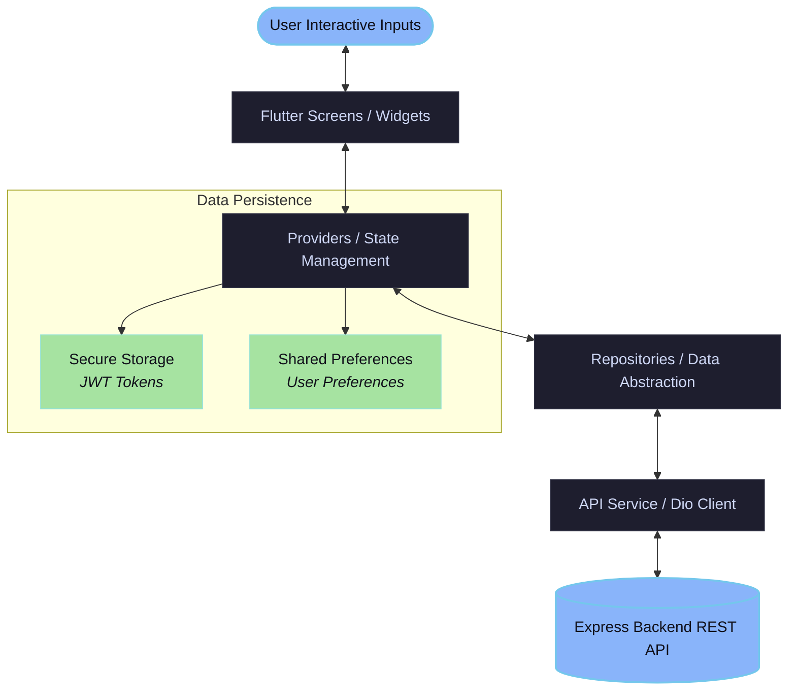

<p align="center">
  
</p>

<h1 align="center">💰 FinTrack — Personal Finance Manager</h1>

<p align="center">
  <strong>Take control of your financial destiny. Track transactions, construct custom budgets, and visualize your wealth in real-time.</strong>
</p>

<p align="center">
  
  
  
  
</p>

---

## ✨ Features

FinTrack is designed to be sleek, intuitive, and highly functional. Here are the core features:

| Feature | Description | Status |
| :--- | :--- | :---: |
| **🔒 Secure Authentication** | Email/Password login & registration with JWT session tokens persisted securely. | ✅ Done |
| **📊 Interactive Dashboard** | View current balance, total income/expenses, quick transaction entries, and recent history. | ✅ Done |
| **💰 Smarter Budgets** | Establish budget limits per category and track your spending progress with real-time indicators. | ✅ Done |
| **🏷️ Category Management** | Classify transaction streams using colorful categories tailored to your lifestyle. | ✅ Done |
| **📈 Visual Reports** | Analyze cash flow and category breakdown using dynamic charts powered by `fl_chart`. | ✅ Done |
| **🔌 Offline Support** | Automatically monitors network connectivity and prevents data state desynchronization. | ✅ Done |

---

## 🏗️ Architecture & Data Flow

FinTrack uses the **Repository Pattern** combined with **Provider** for state management. This ensures a clean separation of concerns:



---

## 📂 Project Structure

The project has a modular, clean folder structure:

```bash
lib/
├── api/             # HTTP clients, interceptors, endpoints config (Dio)
├── core/            # App-wide utilities, theme tokens, constants, global widgets
├── models/          # Strongly typed models (User, Transaction, Budget, Category)
├── providers/       # ChangeNotifier-based providers (Auth, Budget, Dashboard, Transactions, Reports)
├── repositories/    # Middleman layer responsible for data retrieval & parsing
├── routes/          # Navigation configurations powered by GoRouter
└── screens/         # UI Screen Views (Splash, Auth, Dashboard, Budgets, Reports, etc.)
```

---

## 🚀 Getting Started

### 📋 Prerequisites

Before running the application, make sure you have:
*   [Flutter SDK](https://docs.flutter.dev/get-started/install) (version `^3.12.2`)
*   [Dart SDK](https://dart.dev/get-started)
*   A running instance of the [FinTrack Backend API](https://expense-manager-api-qn07.onrender.com/api/) (or a local instance)

### 🛠️ Installation & Setup

1.  **Clone the project** and navigate to the frontend folder:
    ```bash
    cd personal-Finance-Manager/frontend
    ```

2.  **Install dependencies**:
    ```bash
    flutter pub get
    ```

3.  **Configure environment variables**:
    Create a `.env` file in the root of the `frontend` folder (this file is gitignored for security) and add your backend's API base URL:
    ```ini
    BASE_URL=https://your-api-endpoint.com/api/
    ```
    > [!TIP]
    > If you're testing locally with an Android Emulator, use `http://10.0.2.2:5000/api/` as the host IP.

4.  **Run the application**:
    ```bash
    flutter run
    ```

---

## 📦 Key Dependencies

*   **State Management:** `provider`
*   **Routing:** `go_router`
*   **Networking:** `dio` (with auth interceptors)
*   **Charts:** `fl_chart`
*   **Storage:** `flutter_secure_storage` & `shared_preferences`
*   **Environment Config:** `flutter_dotenv`
*   **Connectivity:** `connectivity_plus`

---

## 🔒 Security & Best Practices

*   Sensitive credentials like JWT tokens are kept out of shared storage and stored securely using `flutter_secure_storage` which utilizes Keychain (iOS) and Keystore (Android).
*   All API variables are environment-managed using `flutter_dotenv`.
*   A custom `.gitignore` prevents tracking local keys, configurations, and environment secrets.

---

<p align="center">Made with ❤️ for smart financial planning.</p>
